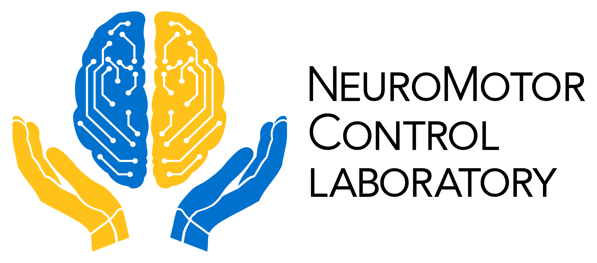

  <a href="https://mcw.marquette.edu/biomedical-engineering/neuromotor-control-lab/" title="Visit our university website (opens in same tab)">
    <picture>
      <source media="(prefers-color-scheme: dark)" srcset="../assets/Horizontal_WhiteWriting.png">
      <source media="(prefers-color-scheme: light)" srcset="../assets/BlackWriting_Horizontal.png">
      
    </picture>
  </a>

# The NeuroMotor Control Laboratory

Led by Professor Dr. Robert Scheidt, the NeuroMotor Control Laboratory at Marquette University is comprised of a multidisciplinary team of biomedical engineers, neuroscientists, and clinicians working to understand how the brain uses sensory information to optimize the control of motion of the arms, hands, and eyes. By understanding how the sensorimotor control systems contribute to dexterous movement and how they degrade due to neural injury—such as stroke and concussion—the NMCL seeks to provide the knowledge and tools needed to develop and deliver individualized training or therapeutic interventions that optimize motor performance throughout the lifespan.

## About Neuromotor Control 

Moving and manipulating objects are key objectives in many activities, such as attaining elite athletic performance and maintaining a high quality of life after stroke. Each of these daily tasks require the execution of complex processes involving neural, sensory, and muscular coordination. Neuromotor control is the ability of the central nervous system to use sensory input to control and remain aware of movement of voluntary musculature in the body, as well as limb posture and orientation. Common lines of interest include rehabilitative neuromotor control, elite performance neuromotor control, and developmental neuromotor control.  
\
Visit our [lab's website](https://mcw.marquette.edu/biomedical-engineering/neuromotor-control-lab/) to learn more about our current and past projects.

## About this GitHub Organization

This org contains repositories used in current and past research. While this org is used to manage active projects, we also host public repositories of completed studies and helpful utilities.

# Our Public Utility Libraries
Feel free to browse our collection of general-purpose helper functions:
- [MATLAB](https://github.com/nmcl-marquette/matlab-utils) `matlab-utils`

